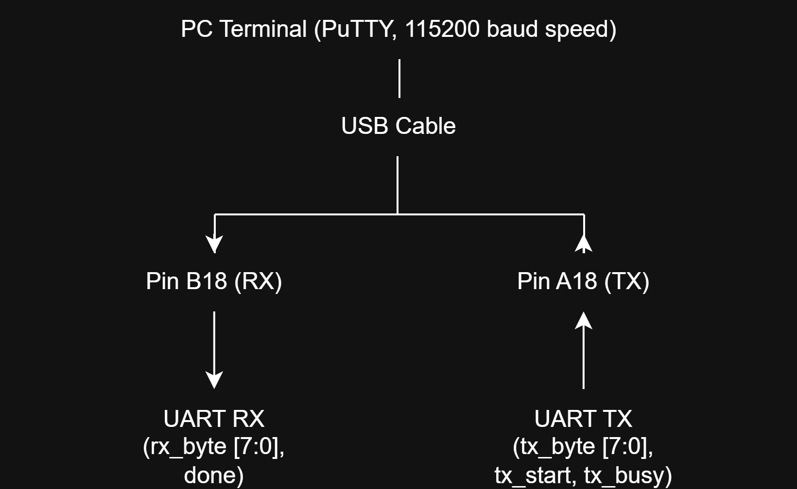
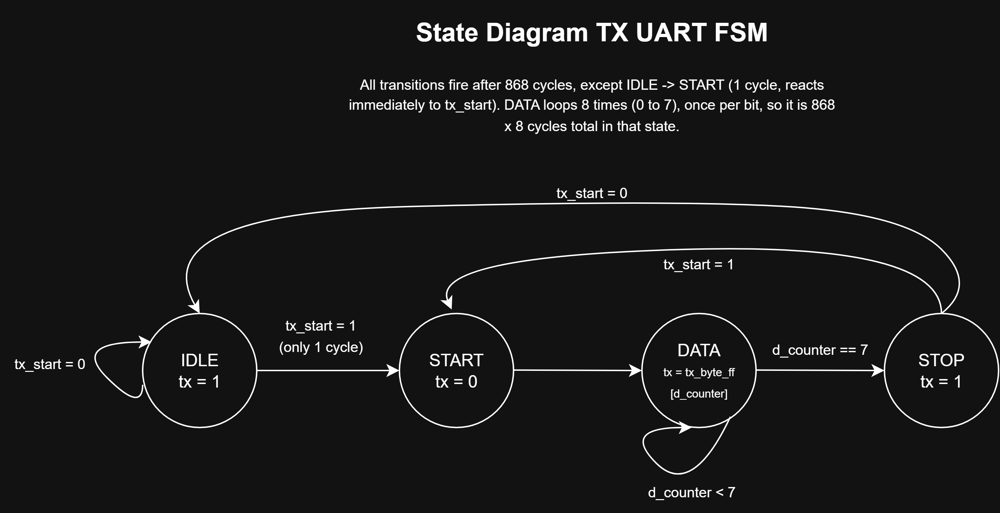
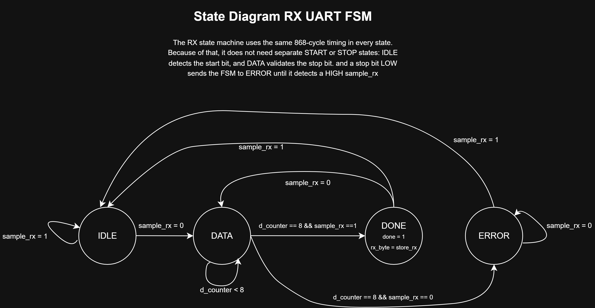
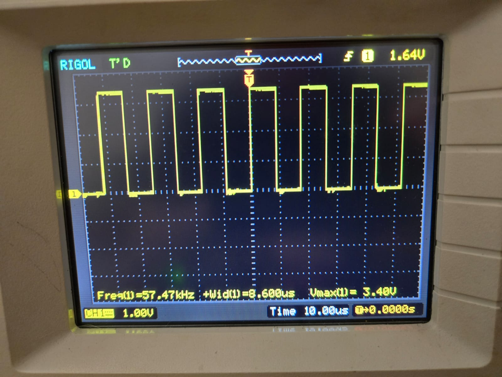
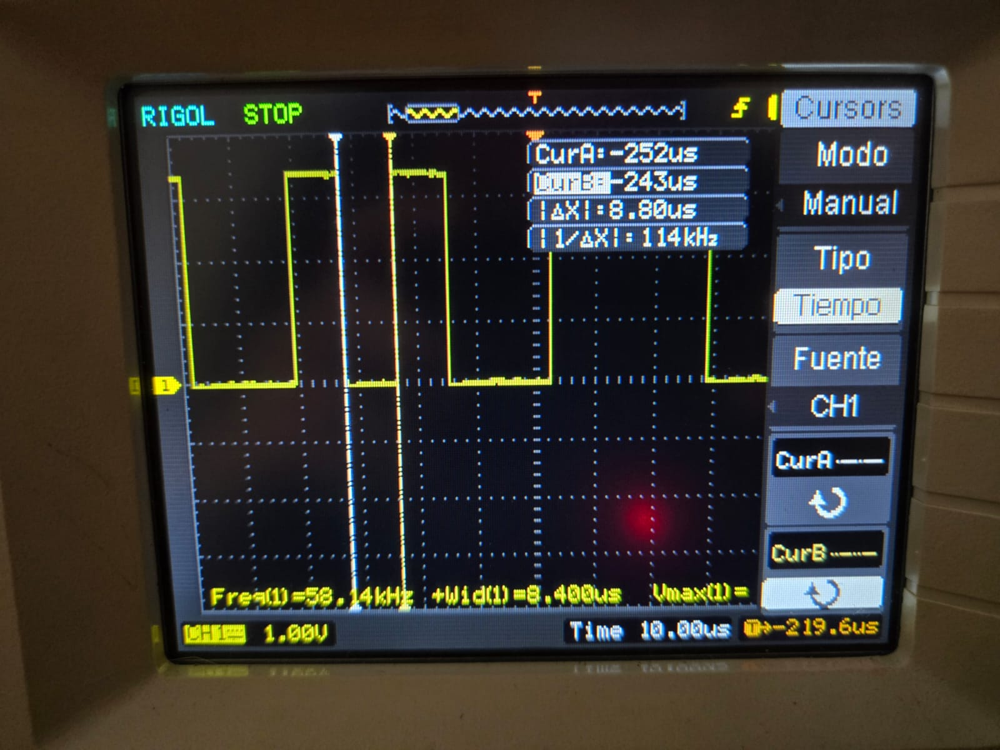

# UART Bring-Up Interface — RV32I SoC

115200 baud · 8N1 · 100 MHz Artix-7 · Validated on Basys 3 FPGA

**Role in the system:**

This UART is the first piece I built for my RV32I SoC project. It works
as the debug and bring-up port for the processor, letting me send
programs, read results back through a PC terminal, and check that the
system is behaving correctly during early hardware testing. It follows
the same kind of workflow used in CPU development when validating new
hardware.

---

## System Architecture

---

## TX FSM

**Why `tx_byte_ff` exists:** `tx_byte` is a combinational input — if it
changes while a transmission is in progress, the output logic would
immediately start reading bits from the new value, corrupting the
frame. `tx_byte_ff` captures `tx_byte` only when `tx_start` is
asserted in IDLE or STOP — the two states where it's safe to load a
new byte — so the entire DATA phase always transmits a stable,
registered value regardless of what happens to `tx_byte` afterward.
This is also why `DATA` in the diagram reads `tx_byte_ff[d_counter]`
and never `tx_byte[d_counter]` directly.

---

## RX FSM

**Two separate samples at the same instant:** every 868-cycle window,
`rx` is captured twice at cycle 433 — into two different registers,
for two different jobs:
- **`sample_rx`** — drives every FSM transition (detecting the start
  bit, validating the stop bit). This is the *control-path* sample.
- **`store_rx[d_counter]`** — captures the actual data bit value
  directly, independent of `sample_rx`. This is the *data-path*
  sample, and it's what eventually becomes `rx_byte`.

Both happen at the same clock edge, from the same signal, but they're
kept as separate registers because they serve different purposes: one
decides *what state to go to next*, the other decides *what byte was
received*. Neither diagram alone shows this — it only becomes visible
in the RTL.

---

## Design Notes

**Why RX has no dedicated START or STOP state:**

The `cycle_counter` in `uart_rx` runs continuously in every state,
including IDLE — it never resets or gates based on the value of `rx`.
This means every state already provides a fixed 868-cycle window with
midpoint sampling (cycle 433) built in, so no state needs to be added
just to "wait and sample" — that behavior already exists everywhere.

- **No START state:** IDLE's own 868-cycle window catches the falling
  edge of the start bit and samples it at the midpoint — no separate
  state needed to detect and validate it.
- **No STOP state:** DATA's transition condition (`d_counter==8`)
  already checks `sample_rx` at that point to validate the stop bit —
  routing to DONE if valid, ERROR if not. A dedicated STOP state would
  just be redundant with the check DATA already performs.
- **DONE reuses the same trick for back-to-back reception:** its own
  868-cycle window samples `rx` again — if a new start bit already
  arrived, it routes straight to DATA instead of IDLE.

TX, by contrast, needs explicit START and STOP states because it
actively drives the line — someone has to decide when the counter
starts and what value `tx` outputs during those windows. RX only
observes, so it can fold that behavior into states that already exist.

---

## Design Parameters

| Parameter        | Value              | Derivation                                  |
|-------------------|--------------------|-----------------------------------------------|
| Clock frequency   | 100 MHz            | Basys 3 onboard oscillator (pin W5)           |
| Baud rate         | 115200 bps          | Standard UART rate                            |
| Cycles per bit    | 868                | 100,000,000 / 115,200 = 868.05 ≈ 868          |
| Baud rate error   | 0.006%             | (868 − 868.05) / 868.05 — within ±2–3% UART tolerance |
| Data format       | 8N1                | 8 data bits, no parity, 1 stop bit            |
| Bit order         | LSB first          | `tx_byte_ff[d_counter]`, `store_rx[d_counter]` |
| Idle line level   | HIGH (1)           | UART standard — line rests HIGH between frames |
| RX sample point   | Cycle 433          | Midpoint of 868-cycle window (868/2 ≈ 434, sampled at 433) |
| TX pin            | A18                | `constraints/*.xdc`                           |
| RX pin            | B18                | `constraints/*.xdc`                           |
| Reset button      | U18 (center button)| `constraints/*.xdc`                           |
| Fmax (post-implementation) | ~227 MHz  | WNS = +5.597ns @ 100MHz clock                 |
| Critical path     | TX cycle_counter[6] → fanout of 10 | Net delay 2.954ns dominates over logic delay 0.890ns |

---

## Verification

### TX Testbench — `tb/tb_uart_tx.sv`

| Test Case | Description                                          | Result |
|-----------|-------------------------------------------------------|--------|
| TC1       | Reset behavior — tx HIGH in IDLE after reset          | ✅ PASS |
| TC2       | Normal transmission — byte 109 (0b01101101)           | ✅ PASS |
| TC3       | Back-to-back bytes — 243 → 99, tx_start pulsed in STOP| ✅ PASS |
| TC4       | Reset mid-DATA — reset asserted during bit 5 of byte 196 | ✅ PASS |

**SVA (3):**
- `p_idle_tx_high` — in IDLE, `tx` must always be HIGH
- `p_start_tx_low` — in START, `tx` must always be LOW
- `p_tx_start_next_cycle_busy` — `tx_start` in IDLE → `tx_busy` HIGH the very next cycle

### RX Testbench — `tb/tb_uart_rx.sv`

| Test Case | Description                                              | Result |
|-----------|-------------------------------------------------------------|--------|
| TC1       | Reset behavior — done LOW in IDLE after reset              | ✅ PASS |
| TC2       | Normal reception — byte 0b10011101, done pulses then clears| ✅ PASS |
| TC3       | Missing stop bit — byte 0b00101010 with corrupted framing, FSM → ERROR, done stays LOW | ✅ PASS |
| TC4       | Reset mid-frame — reset asserted after bit 2 of reception   | ✅ PASS |
| TC5       | Back-to-back bytes — 0b11100101 → 0b01000001, second byte's data verified | ✅ PASS |

**SVA (2):**
- `p_idle_done_low` — in IDLE, `done` must always be LOW
- `p_error_done_low` — in ERROR, `done` must always be LOW

### Loopback Testbench — `tb/tb_complete_uart.sv`

TX and RX instantiated together, `tx_signal` wired directly from TX output to RX input — end-to-end proof that a transmitted byte is received correctly bit-for-bit.

| Test Case | Description                                            | Result |
|-----------|------------------------------------------------------------|--------|
| TC1       | Reset behavior — tx_signal HIGH in IDLE after reset       | ✅ PASS |
| TC2       | Normal end-to-end transfer — byte 150, `rx_byte === expected_byte` | ✅ PASS |
| TC3       | Back-to-back — 35 → 243, both bytes verified end-to-end   | ✅ PASS |
| TC4       | Reset mid-DATA transfer — byte 196, reset during bit 5     | ✅ PASS |

**SVA (4):** same 3 from TX, plus:
- `p_idle_done_low` — in RX IDLE, `done` must always be LOW

**Key check:** `rx_byte !== expected_byte` inside `verify_tx()` — this is the actual end-to-end proof that TX and RX agree on every bit of every byte transmitted.

---

## Hardware Validation — Basys 3 (Artix-7 XC7A35T)

### Bring-up sequence completed

| Stage | Module | What it proves |
|-------|--------|-----------------|
| 1 | `bringup_1_loopback_internal.sv` | TX output wired directly to RX input on-chip — LED confirms correct byte reception without any external hardware |
| 2 | `bringup_2_tx_to_pc.sv` | Basys 3 transmits bytes to a PC terminal (PuTTY) — confirms TX works against real external hardware |
| 3 | `bringup_3_rx_from_pc.sv` | PC terminal sends bytes to Basys 3 — LED confirms correct reception |
| 4 | `bringup_4_echo_bidirectional.sv` | Full bidirectional communication, PC ↔ FPGA, at 115200 baud |
| 5 | `bringup_5_oscilloscope_probe.sv` | Dedicated free-running transmitter for direct electrical measurement on the physical UART line |

### Oscilloscope validation — RIGOL DS1102E

**Choosing a test byte:** the first attempt used an alternating pattern (`01010101`), producing a uniform square wave where every bit looks identical — impossible to tell which bit is which on screen.

Switched to **`8'b11001010`** (0xCA) instead — the mix of different run lengths makes individual start/data/stop bits visually distinguishable.

- **Probe:** 10X attenuation
- **Trigger:** falling edge, CH1, 1.64V (scope's closest setting to the 1.65V true midpoint of the 0–3.3V swing)
- **Measured bit width:** 8.4–8.8µs across readings (expected 8.68µs, 1.4–3.2% error — within UART's typical ±2–3% tolerance; variation is expected from manual cursor placement, not a design fault)
- **Note:** the scope's automatic `Freq`/`Duty` measurements assume a periodic signal — since a UART frame's bit pattern isn't strictly periodic, those auto-readings aren't meaningful here (e.g. `-Duty=102.3%` is not physically valid). The reliable measurement is direct pulse width (`+Wid`), taken on a single bit.
- **Probe point:** Pmod TPH2 header, not pin A18 directly — A18 feeds into the Basys 3's onboard USB-UART bridge chip, not easily accessible for direct probing

### Design fix during bring-up: making IDLE visible on the scope

The version above transmits back-to-back with `tx_start` held HIGH continuously — START, DATA, and STOP bits are all visible, but **IDLE never appears**, because unlike every other state, IDLE has no fixed duration unless something forces one.

Fix: `bringup_5_oscilloscope_probe.sv` adds a dedicated `idle_counter` that holds `tx_start` LOW for exactly 868 cycles — the same width as every other bit — before pulsing it HIGH again. This gives IDLE the same visible width as START, DATA, and STOP on the scope.

---

## Bugs Found and Fixed

### Bug 1: cycle_counter running freely in IDLE (TX)
**Detected by:** Logic review during design
**Root cause:** The counter incremented in every state, including IDLE.
If `tx_start` arrived mid-count, the START bit would be shorter than
868 cycles, corrupting the frame.
**Fix:** Added `else cycle_counter <= 0` for IDLE — the counter holds
at zero while idle, guaranteeing every bit gets exactly 868 cycles.

### Bug 2: Multiple driver on `state`
**Detected by:** Vivado synthesis error
**Root cause:** Two separate `always` blocks both drove `state` — one
for normal FSM transitions, one for the direct IDLE→START transition.
Verilog does not allow two blocks driving the same signal.
**Fix:** Merged both into a single `always @(posedge clk)` block with
priority `if/else if` — reset highest priority, then `tx_start && IDLE`,
then `cycle_counter == 867`.

### Bug 3: tx_byte_ff not captured in STOP state
**Detected by:** Back-to-back byte test case failing in simulation
**Root cause:** `tx_byte_ff` only captured `tx_byte` when `state == IDLE`.
For back-to-back transmission, STOP transitions directly to START,
bypassing IDLE — so `tx_byte_ff` never updated with the new byte.
**Fix:** Changed the capture condition to `state == IDLE || state == STOP`.

### Bug 4: IDLE → START transitions in 1 cycle, not 868
**Detected by:** Comparing `$time` values in the Tcl console during
loopback testbench debugging — found by inspecting timing directly,
not from a code review.
**Root cause:** Every FSM transition depends on `cycle_counter == 867`
— except IDLE → START, which has no relation to the counter and fires
on the very next clock edge once `tx_start` goes HIGH. `repeat(868)`
after asserting `tx_start` landed 867 cycles into the START state
instead of at its beginning, desynchronizing every subsequent bit check.
**Fix:** `repeat(1)` to consume the 1-cycle transition, plus an
additional `repeat(300)` purely so `tx_start` is visibly wide in the
waveform (a debugging aid, not functionally required). Total: 1 + 300
+ 568 (remaining cycles handled inside `verify_tx()`) = 869 cycles.

### Bug 5: IDLE state invisible on oscilloscope
**Detected by:** Visual inspection of the RIGOL DS1102E waveform during
hardware bring-up
**Root cause:** The first oscilloscope test module held `tx_start` HIGH
continuously — bytes transmitted back-to-back with no gap. Unlike
START, DATA, and STOP (always exactly 868 cycles because the FSM's own
counter drives them), IDLE has no fixed duration unless something
external forces one — so it lasted 0 visible cycles and never appeared.
**Fix:** `bringup_5_oscilloscope_probe.sv` adds a dedicated
`idle_counter` that holds `tx_start` LOW for exactly 868 cycles —
matching every other bit's width — before pulsing it HIGH again.

---

### Safety note (not a design bug)
While probing with the oscilloscope, connecting the scope's ground clip
while the Basys 3 was already powered caused a visible spark at the
connection point. **Rule going forward: always connect all probes and
grounds to unpowered hardware first, then power on** — never connect or
disconnect anything from live digital hardware.

---

## How to Simulate

### Requirements
- Xilinx Vivado 2023.x or later (any edition with the simulator, xsim)
- Basys 3 board — only needed for hardware validation, not for simulation

### Setting up the project
1. Create a new Vivado project (RTL Project, do not specify a part yet if just simulating; use `xc7a35tcpg236-1` if you plan to synthesize for Basys 3)
2. Add all files from `src/` as design sources
3. Add all files from `tb/` as simulation sources
4. Add all files from `constraints/` as constraint sources (only needed for synthesis/implementation, not for simulation)
5. For the three `.sv` files in `src/` (`bringup_1_loopback_internal.sv`, `bringup_4_echo_bidirectional.sv`, `bringup_5_oscilloscope_probe.sv`), confirm Vivado treats them as SystemVerilog: right-click the file in Sources → **Source File Properties** → **Type** → **SystemVerilog**

### Run TX testbench
1. In the Sources panel, right-click `tb/tb_uart_tx.sv` → **Set as Top**
2. Flow Navigator → **Run Simulation → Run Behavioral Simulation**
3. In the Tcl Console: `run -all`
4. Check the Tcl Console log for `PASS`/`FAIL` on each of the 4 test cases

### Run RX testbench
1. Right-click `tb/tb_uart_rx.sv` → **Set as Top**
2. **Run Simulation → Run Behavioral Simulation**
3. `run -all`
4. Check for `PASS`/`FAIL` on each of the 5 test cases

### Run loopback testbench (end-to-end)
1. Right-click `tb/tb_complete_uart.sv` → **Set as Top**
2. **Run Simulation → Run Behavioral Simulation**
3. `run -all`
4. Check for `PASS`/`FAIL` on each of the 4 test cases, plus the SVA assertion messages in the log

### Expected output
All test cases should report `PASS`. Any `FAIL` in the Tcl Console log indicates a regression — check the corresponding line number in the testbench against the module it's testing.

### Running on hardware (Basys 3)
To synthesize any of the 5 bring-up stages instead of simulating:
1. Right-click the corresponding file in `src/` (e.g. `bringup_4_echo_bidirectional.sv`) → **Set as Top**
2. Make sure only the matching `.xdc` from `constraints/` is enabled (disable the other 4 to avoid pin conflicts)
3. Flow Navigator → **Run Synthesis → Run Implementation → Generate Bitstream**
4. **Hardware Manager → Open Target → Program Device**
